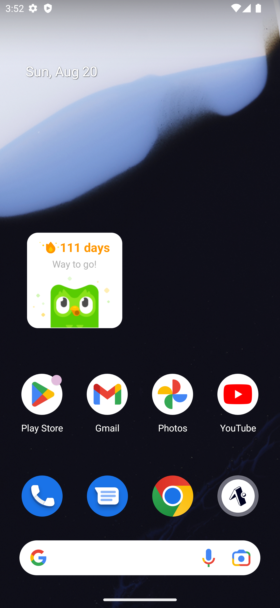
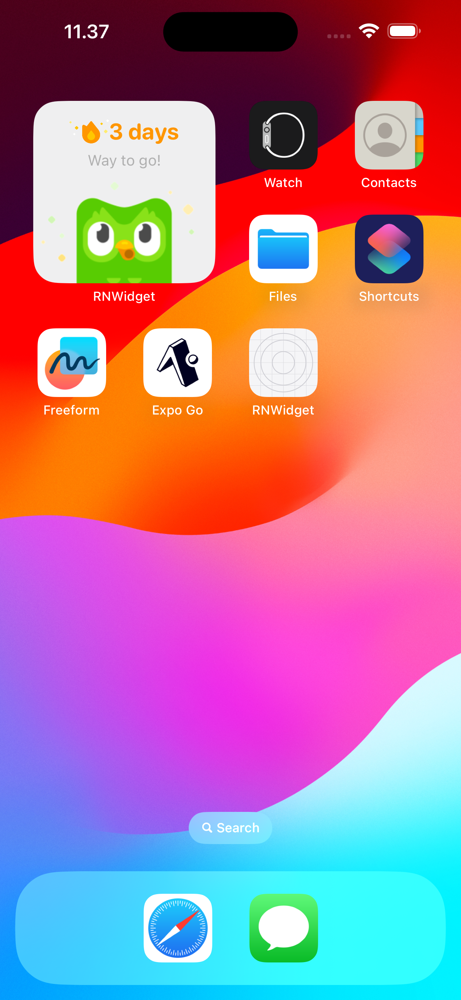

# Expo React-Native Widget Creation: A Study Case

This repository serves as a detailed study case on how to create widgets using Expo and React Native for cross-platform mobile applications targeting Android and iOS.

<p align="center">
  
  
</p>

## Table of Contents

1. [Introduction](#introduction)
2. [Prerequisites](#prerequisites)
3. [Getting Started](#getting-started)
4. [Creating the Widget](#creating-the-widget)
5. [Testing](#testing)
6. [Resources](#resources)
7. [Contributing](#contributing)
8. [License](#license)

## Introduction

With the growing popularity of widgets on both Android and iOS platforms, it's essential for developers to know how to create these efficiently using the tools at their disposal. This study case explores the process of creating widgets with Expo in a React Native environment.

## Prerequisites

- [Node.js](https://nodejs.org/)
- [Expo CLI](https://expo.dev/tools/cli)
- [React Native](https://reactnative.dev/)
- A mobile device/emulator with either Android or iOS.

## Getting Started

1. **Clone the Repository**

```bash
git clone https://github.com/ImBIOS/RNWidget.git
cd RNWidget
```

2. **Install Dependencies**

```bash
bun install
```

3. **Start the Expo Development Server**

```bash
bun run start # expo start
```

This will open a new window in your default browser displaying a QR code. Scan this code using the Expo Go app on your mobile device or use an emulator.

<!-- ## Creating the Widget

This section provides a step-by-step guide on creating a simple widget using Expo and React Native:

1. **Initialize a New React Native Project with Expo**

... [Steps Here]

2. **Integrate Widget Libraries**

... [Steps Here]

3. **Design the Widget UI**

... [Steps Here]

4. **Integrate Functionality and Logic**

... [Steps Here]

(Continue with additional steps as required.)

## Testing

It's vital to test your widget on both Android and iOS platforms to ensure compatibility:

1. **Testing on Android**

... [Steps Here]

2. **Testing on iOS**

... [Steps Here] -->

## Resources

- [Expo Documentation](https://docs.expo.dev/)
- [React Native](https://reactnative.dev/docs/)

## Contributing

Contributions are welcome! Please see our [CONTRIBUTING.md](https://github.com/ImBIOS/.github/blob/main/CONTRIBUTING.md) for details.

## License

This project is licensed under the MIT License. See the [LICENSE](./LICENSE) file for details.
